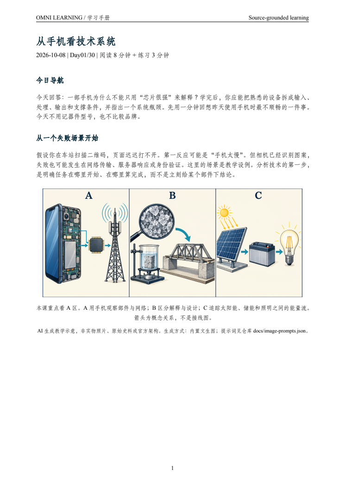
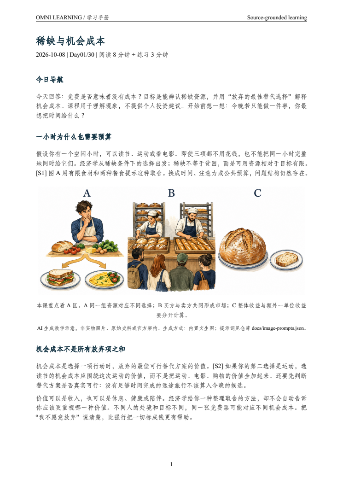
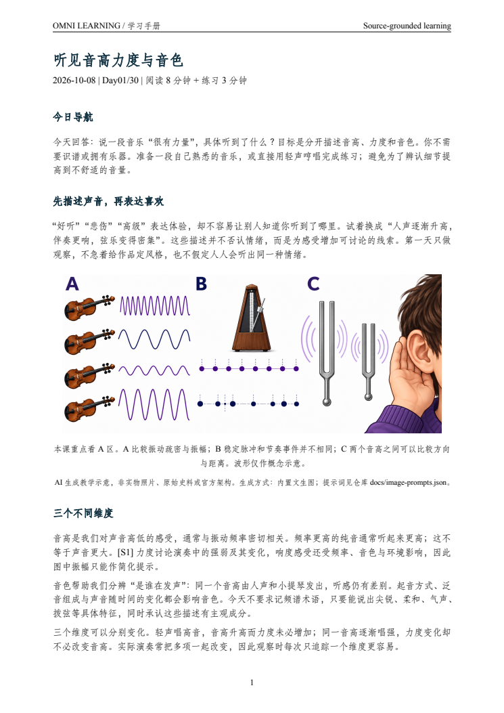
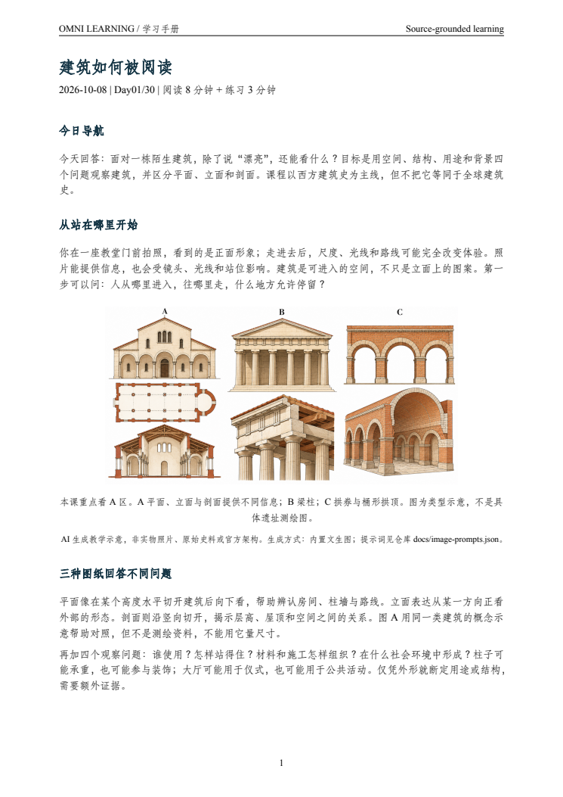
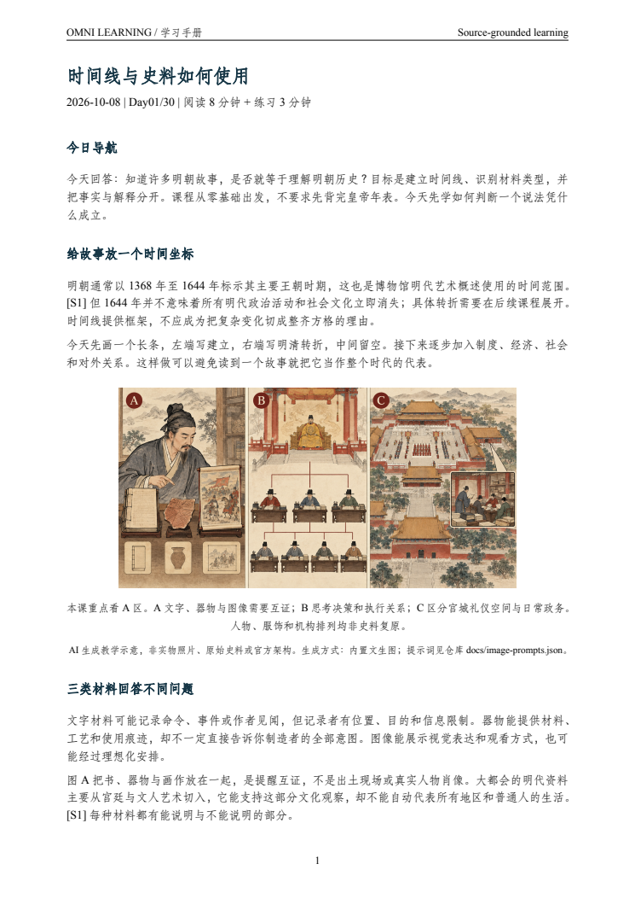
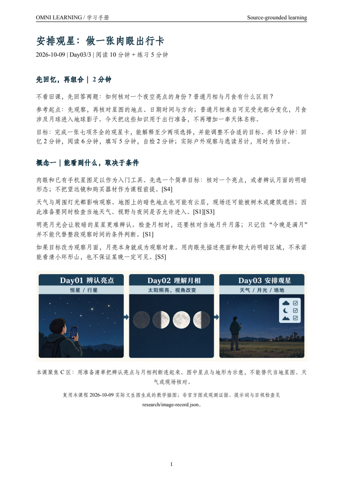
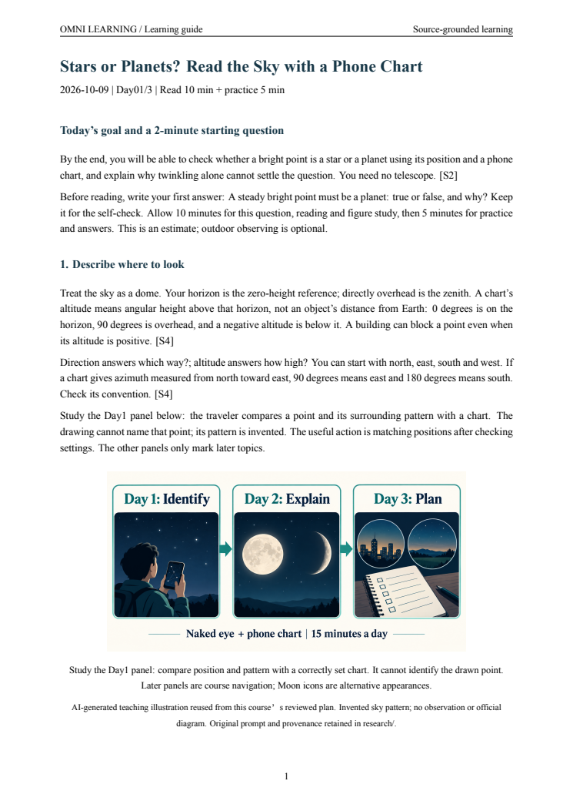

# Omni Learning Assistant

**把「我想学……」变成一条每天可以走下去的学习路径。**  
**Turn “I want to learn…” into a source-grounded daily learning path.**

[下载发布版 / Releases](https://github.com/ShawnRen57/omni-learning-assistant/releases) · [中文](#中文使用指南) · [English](#english-guide) · [生成样例 / Examples](#学习样例与截图--see-the-results) · [验证记录 / Validation](docs/validation.md) · [v1.0.0 中英验收 / Bilingual acceptance](validation/release-v1.0.0/README.md) · [DSH 社区展示 / Community showcase](https://github.com/deepseek-ai/deepseek-harness/discussions/9207)

Omni Learning Assistant 将你的 Agent 变成一位围绕目标组织课程的学习助手。告诉它你想学什么，它会了解你的基础、目标和可投入的时间，先交付一份 **PDF 学习计划**，等你确认后，再按计划制作每天的 **图文学习材料**。

遵循 [Agent Skills 标准](https://agentskills.io/specification)，可安装到 Codex、WorkBuddy、DeepSeek Harness、OpenClaw、豆包工作界面等支持技能的 Agent 中。

Omni Learning Assistant turns your agent into a learning assistant that builds a course around your goals. Start with a topic; it clarifies your background and available time, delivers a **PDF plan for approval**, then creates **illustrated daily lessons** along that plan. It follows the [Agent Skills standard](https://agentskills.io/specification) and uses your agent's tools for research, document creation and scheduling.

### 用熟悉的语言学习 / Learn in your preferred language

目前支持**中文与英文**学习计划和材料生成：你可以用中文学习天文学，也可以用英文学习中国历史。输出语言在开始时确认，不必与主题或来源语言相同。其他主流语言（如日语、韩语、法语、德语、西班牙语、葡萄牙语等）的 PDF 输出尚待扩展，当前版本不将其列为已支持。

Create learning plans and materials in **Chinese or English**, independently of the subject or source language. Choose your output language during intake. PDF output in other widely used languages, such as Japanese, Korean, French, German, Spanish and Portuguese, is not yet supported by the bundled renderer.

### 从一句“我想学”到每天有收获 / From a topic to daily progress

- **贴合你的目标**：同样学建筑，可以为旅行欣赏、专业入门或工作任务安排不同的路线。 / **Your goals shape the course**: learn for travel, professional foundations or a practical task.
- **适合每天学一点**：按约定的时间聚焦一个主题，配上例子、练习和自检，选读另计。 / **A manageable daily lesson**: focused explanations, examples, practice and self-checks within your time budget.
- **知道知识从哪里来**：每次生成都会联网检索，关键内容附来源，每份材料提供至少五个带说明的扩展链接。 / **Traceable knowledge**: fresh research, linked evidence and at least five useful expansion links per document.
- **留下完整的学习档案**：PDF 便于阅读与保存，可编辑源文件便于回顾；续学时检查进度，失败后接着同一课完成。 / **A course you can keep**: readable PDFs, editable sources and progress that resumes from the same lesson after a failure.

## 你想学什么？ / What would you like to learn?

从建立一门学科的知识框架，到钻研一个具体问题，都可以从你的目标出发安排课程。下面是选题示例；实际内容会按你的基础、学习时长和用途调整。

From building foundations in a subject to exploring a focused question, the course adapts to your background, time and purpose. These are topic ideas; generated examples are shown below.

| 知识领域 / Area | 可以从这些主题开始 | 学习目标举例 |
|---|---|---|
| 人工智能与前沿科技 / AI & emerging technology | 大模型、Agent、机器学习、机器人、智能家居、科技趋势 | 用自己的话解释技术原理，判断产品能力与适用场景 |
| 计算机与软件开发 / Computing & software | Python、SQL、计算机网络、数据库、操作系统、软件工程 | 从概念走向小练习，理解程序与系统如何工作 |
| 数学与统计 / Mathematics & statistics | 概率、统计、线性代数、微积分、数据分析、实验设计 | 理解公式背后的问题，读懂数据与推断的条件 |
| 自然科学 / Natural sciences | 物理、化学、生物、天文学、地球科学、气候科学 | 用现象、模型和证据解释身边的世界 |
| 工程与产业 / Engineering & industry | 电子、机械、能源、材料、制造、交通、航空航天 | 看懂系统结构、关键约束和技术取舍 |
| 经济与公共政策 / Economics & public policy | 供需、宏观经济、货币政策、产业政策、国际贸易 | 理解经济现象，区分模型假设与现实证据 |
| 金融与财务知识 / Finance & financial literacy | 会计、财报、资产类别、风险收益、金融史 | 读懂财务指标，建立风险与收益的基础认识 |
| 商业与管理 / Business & management | 商业模式、战略、营销、运营、组织、供应链 | 用案例拆解业务问题，形成有依据的分析 |
| 产品与设计 / Product & design | 产品管理、用户研究、交互设计、服务设计、Agent 产品 | 将知识用于需求判断、方案比较和产品决策 |
| 职业与工作方法 / Career & work methods | 岗位面试、项目管理、写作表达、沟通协作、知识管理 | 围绕真实任务练习，积累可复用的方法与作品 |
| 历史与文明 / History & civilizations | 中国史、世界史、明朝历史、文明交流、制度史 | 建立时间线，联系人物、制度与史料 |
| 哲学与逻辑 / Philosophy & reasoning | 哲学史、伦理学、认识论、逻辑、批判性思维 | 辨认论点、前提和反例，练习清楚地推理 |
| 社会与法律常识 / Society & legal literacy | 社会学、人类学、传播、法律制度、社会议题 | 理解概念与制度，比较不同解释的依据 |
| 心理与教育 / Psychology & education | 认知、记忆、学习方法、发展心理、教育理论 | 理解行为与学习的机制，设计小规模实践 |
| 语言与文学 / Languages & literature | 外语基础、语法、阅读、写作、文学史、作品分析 | 按目标组织练习，读懂表达与作品的文化语境 |
| 音乐与表演艺术 / Music & performing arts | 古典音乐史、爵士、乐理、电影、戏剧、舞蹈 | 结合聆听与观看，理解结构、风格和创作背景 |
| 美术与视觉文化 / Art & visual culture | 绘画、雕塑、摄影、艺术史、平面设计、视觉叙事 | 训练观察，联系作品形式、材料与时代 |
| 建筑与城市 / Architecture & cities | 西方建筑史、中国建筑、结构、城市规划、景观 | 旅行时能观察空间、材料和建筑的使用方式 |
| 地理与旅行文化 / Geography & travel culture | 自然地理、人文地理、地方文化、博物馆、文化遗产 | 把地理与历史知识用于理解旅行中的见闻 |
| 健康、运动与生活知识 / Health, sport & everyday knowledge | 人体基础、营养常识、运动科学、烹饪、园艺、可持续生活 | 理解基础原理，建立有来源的日常知识框架 |

<details>
<summary>English topic catalog</summary>

| Area | Topics to start with | Example learning outcome |
|---|---|---|
| AI & emerging technology | LLMs, agents, machine learning, robotics, smart homes, technology trends | Explain mechanisms and assess product capabilities and use cases |
| Computing & software | Python, SQL, networking, databases, operating systems, software engineering | Build understanding through focused programming and system exercises |
| Mathematics & statistics | Probability, statistics, linear algebra, calculus, data analysis, experiment design | Understand models, data and the assumptions behind inference |
| Natural sciences | Physics, chemistry, biology, astronomy, Earth and climate science | Explain phenomena using models and evidence |
| Engineering & industry | Electronics, mechanics, energy, materials, manufacturing, transport, aerospace | Understand system structures, constraints and trade-offs |
| Economics & public policy | Supply and demand, macroeconomics, monetary and industrial policy, trade | Interpret economic phenomena and separate assumptions from evidence |
| Finance & financial literacy | Accounting, financial statements, asset classes, risk and return, financial history | Read financial indicators and understand risk and return |
| Business & management | Business models, strategy, marketing, operations, organizations, supply chains | Analyze business problems through evidence and cases |
| Product & design | Product management, user research, interaction and service design, agent products | Apply learning to needs, alternatives and product decisions |
| Career & work methods | Interview preparation, project management, writing, collaboration, knowledge management | Practice realistic tasks and build reusable methods and work samples |
| History & civilizations | Chinese and world history, Ming history, cultural exchange, institutional history | Connect chronology, people, institutions and historical sources |
| Philosophy & reasoning | History of philosophy, ethics, epistemology, logic, critical thinking | Identify claims, premises and counterexamples |
| Society & legal literacy | Sociology, anthropology, communication, legal systems, social issues | Understand institutions and compare competing explanations |
| Psychology & education | Cognition, memory, learning methods, developmental psychology, educational theory | Understand mechanisms and design small learning activities |
| Languages & literature | Language basics, grammar, reading, writing, literary history, textual analysis | Organize practice around goals and understand cultural context |
| Music & performing arts | Classical music history, jazz, music theory, cinema, theatre, dance | Learn through listening and viewing, with structure and context |
| Art & visual culture | Painting, sculpture, photography, art history, graphic design, visual storytelling | Connect observation with form, materials and historical context |
| Architecture & cities | Western and Chinese architecture, structures, urban planning, landscapes | Read spaces, materials and uses when exploring buildings and cities |
| Geography & travel culture | Physical and human geography, local cultures, museums, cultural heritage | Use geography and history to interpret travel experiences |
| Health, sport & everyday knowledge | Human biology, nutrition literacy, sport science, cooking, gardening, sustainability | Build an evidence-based framework for everyday knowledge |

</details>

## 学习样例与截图 / See the results

六组样例均含完整 **30 天计划 + Day01 + Day02 + Day03**，共 **24 份 PDF**；样例为中文。它们使用演示身份、模拟计划批准与连续交付，**没有创建真实定时任务**。联网核验日期为 2026-10-08，详见[研究记录](docs/research-notes.md)。前三天共用一张分区插图，逐课聚焦 A/B/C 区以保持连贯。

| 学习主题 | 一句话开始 | 材料中的学习重点 |
|---|---|---|
| 科技通识 / Technology | `我想系统学习科技，能看懂重要技术趋势。` | 系统、证据与能量 |
| 经济学 / Economics | `我想从零学习经济学，理解日常经济现象。` | 选择、供需与边际决策 |
| 音乐通识 / Music | `我想学习音乐，提升欣赏不同作品的能力。` | 主动聆听、节奏与旋律 |
| Agent 产品设计 / Agent products | `我想学习 Agent 产品设计，准备产品经理面试。` | 任务、控制方式与权限 |
| 西方建筑史 / Architecture | `我想学习西方建筑史，旅行时能看懂建筑。` | 空间、柱式与拱券 |
| 明朝历史 / Ming history | `我想系统学习明朝历史，理解重要制度和事件。` | 时间线、制度与史料 |

Each of the six Chinese sample courses includes a full **30-day plan + Days 1–3**, totaling **24 PDFs**. They use simulated approval and delivery with no live schedules. Sources were checked on 2026-10-08.

以下均为真实生成 PDF 的首屏截图。点击主题进入该组的四份文档与可复用源文件；[总索引](examples/README.md)提供全部 PDF 的直接链接。

| 科技通识 / Technology | 经济学 / Economics | 音乐通识 / Music |
|---|---|---|
| [](examples/technology) | [](examples/economics) | [](examples/music) |

| Agent 产品 / Agent product | 西方建筑史 / Architecture | 明朝历史 / Ming history |
|---|---|---|
| [](examples/agent-product) | [](examples/architecture) | [](examples/ming-history) |

### 中英文生成效果 / Chinese & English output

旅行观星入门展示同一学习目标下的中文与英文材料：中文计划与 Day01–03、英文计划与 Day01，共六份最终 PDF。点击截图查看各语言的完整文档、可编辑源文件和生成记录。

The night-sky course demonstrates Chinese and English output for the same learning goal: a Chinese plan and Days 1–3, plus an English plan and Day 1. [Browse all six PDFs and their source files](validation/release-v1.0.0/README.md).

| 中文 Day03：做一张观星出行卡 | English Day01: Read the sky with a phone chart |
|---|---|
| [](validation/release-v1.0.0/README.md) | [](validation/release-v1.0.0/README.md) |

这是隔离验收样例，学习者、批准与收件为模拟记录，没有创建真实定时任务；来源核验日期为 2026-10-09。[验收报告](docs/release-validation-v1.0.0.md)记录实际运行与中断恢复。

These are isolated acceptance samples with simulated learners, approvals and receipts, without live schedules. Sources were checked on 2026-10-09; the [report](docs/release-validation-v1.0.0.md) describes execution and interruption recovery.

## 中文使用指南

### 1. 安装

#### a. 通用快捷安装（对话指令）

把下面的消息发送到 Agent 对话框，由 Agent 按当前客户端的原生技能方式安装：

```text
请安装 omni-learning-assistant：
https://github.com/ShawnRen57/omni-learning-assistant
请优先下载 Releases 最新的轻量 Skill ZIP，完整安装并保留 scripts、references、agents。
安装后确认技能可发现，并告诉我如何开始使用。
```

客户端要求手动上传时，下载 [Skill ZIP](dist/omni-learning-assistant-skill-v1.0.0.zip)，按下方步骤完成。

#### b. 手动安装（按平台）

上传时选择 ZIP；目录安装时解压并复制整个 `omni-learning-assistant/` 文件夹。

| Agent | 手动操作 | 官方依据 |
|---|---|---|
| Codex | 放入 `~/.agents/skills/omni-learning-assistant/`，或项目 `.agents/skills/`；确认加载后用 `$omni-learning-assistant` 调用 | [Skills 文档](https://learn.chatgpt.com/docs/build-skills) |
| WorkBuddy | **专家 · 技能 · 连接器 → 技能 → 添加技能 → 上传技能**，选择 ZIP，导入后启用 | [技能说明](https://www.codebuddy.cn/docs/workbuddy/From-Beginner-to-Expert-Guide/Function-Description/Skills-Market) |
| DeepSeek Harness | 放入 `~/.dsh/skills/omni-learning-assistant/`，或项目 `.dsh/skills/`；在技能目录确认加载 | [文件系统 Skill provider](https://github.com/deepseek-ai/deepseek-harness/blob/master/packages/skill/skill-filesystem/README.md) |
| OpenClaw | 解压后执行 `openclaw skills install /path/to/omni-learning-assistant --global`，再用 `openclaw skills list` 查看 | [Skills CLI](https://docs.openclaw.ai/cli/skills) |
| 豆包工作界面 | **插件 · 技能 · 伙伴 → 技能 → 添加 → 上传技能**；选 **选择文件**上传 ZIP，或 **选择文件夹**导入完整目录 | 官方桌面端 2.31.4 上传界面核对，2026-10-09 |

DSH 的“插件 → 添加插件”用于 DSH 插件组合包；本项目采用上表的原生 Skill 目录安装。豆包步骤适用于提供上述技能入口的工作界面。更多操作细节和依据见 [安装说明](skills/omni-learning-assistant/references/install.md)。

Agent 会检查学习材料所需的工具与 Python 3.10+、XeLaTeX 环境，按 [环境说明](skills/omni-learning-assistant/references/setup.md)处理缺失依赖。

### 2. 只说你想学什么

```text
用 omni-learning-assistant 带我学习西方建筑史，目标是旅行时能看懂建筑。
```

Agent 会集中追问：学习目标和已有基础、学习多少天、每天几分钟、每日执行时间与时区、是否包括周末、文档语言及保存位置。你已经提供的信息不会重复询问。

也可以一次说完整：

```text
用 omni-learning-assistant 学习 Agent 产品设计。我是产品经理，有产品经验但 AI 基础有限。
目标是能独立定义 Agent 产品并准备面试。学习 30 天，每天 15 分钟，
每天 10:00，Asia/Shanghai，含周末，中文，保存到我指定的课程文件夹。
先给我 PDF 计划，等我确认后创建每日任务；确认后立即开始 Day01。
```

默认在约定时间**开始生成**，完成检索与检查后交付；不承诺在同一时刻送达。没有可用调度器时，Agent 会说明限制，并提供手动续学方式。

### 3. 确认计划，再开始课程

你先收到包含每日主题、学习目标和节奏的 PDF，随后可回复：

```text
确认这份计划，按上述时间开始，每日材料保存到这个课程目录。
```

之后每份学习材料包含概念说明、教学插图、练习与参考要点、承上启下的回顾，以及不少于 5 个带说明的扩展链接。核心阅读与练习以约定时间为限，选读另计。中文优先仿宋，英文优先 Times New Roman；本机缺字库时使用可用字体，实际结果保留在生成记录中。

继续、暂停和调整示例：

```text
继续这个 Omni Learning Assistant 课程，先检查上次交付到了哪一天。
暂停这个课程，同时暂停对应的定时任务。
我想调整学习目标，请保留旧档案，为我生成新的计划供确认。
```

内容生成、检查、交付分别记录；失败不跳课，重复执行优先复用已有文档。通知与本地文件写入并非原子操作，遇到不确定状态会核对交付记录。收到 PDF 不会被记为已经掌握知识。

## English guide

### Install

#### a. Quick installation through chat

Send this message in your agent's conversation:

```text
Install omni-learning-assistant from:
https://github.com/ShawnRen57/omni-learning-assistant
Prefer the latest lightweight Skill ZIP in Releases. Use this client's native
skill installation mechanism, keep all bundled resources, then verify discovery.
```

If the client requires an upload, download the [Skill ZIP](dist/omni-learning-assistant-skill-v1.0.0.zip) and follow the steps below.

#### b. Manual installation by agent

| Agent | Steps |
|---|---|
| Codex | Copy the extracted folder into user/project `.agents/skills/`; invoke `$omni-learning-assistant`. |
| WorkBuddy | Experts / Skills / Connectors → Skills → Add skill → Upload skill; select the ZIP and enable it. |
| DeepSeek Harness | Copy the complete bundle into user `~/.dsh/skills/` or project `.dsh/skills/`; verify discovery. |
| OpenClaw | Run `openclaw skills install /path/to/omni-learning-assistant --global`, then `openclaw skills list`. |
| Doubao work mode | Plugins / Skills / Partners → Skills → Add → Upload skill; select the ZIP or folder. |

The [installation guide](skills/omni-learning-assistant/references/install.md) links to the official sources. Doubao's upload steps were checked in its official macOS desktop client. DSH's Add plugin dialog handles plugin bundles; use filesystem skill installation for this package.

The agent checks research, execution, image and PDF tools plus Python/XeLaTeX dependencies. See [runtime setup](skills/omni-learning-assistant/references/setup.md).

### Start with a topic

```text
Use $omni-learning-assistant to teach me Western architectural history so I can understand buildings when traveling.
```

The agent asks for missing goals, prior knowledge, course length, daily study time, execution time/timezone, weekdays, language and output folder. For a complete request:

```text
Use $omni-learning-assistant to help me learn Agent product design. I am a product manager
with limited AI background. Plan 30 days at 15 minutes per day, at 10:00
Asia/Shanghai including weekends. Use English and save to my course folder.
Send the PDF plan first. Wait for my approval before scheduling daily lessons.
Start Day01 immediately after approval.
```

Approve the plan or request revisions. The agent then creates and verifies a native host task when supported. Generation starts at the scheduled time; delivery follows research and checks. Without a suitable scheduler, continuation remains manual.

Each lesson includes focused explanation, an illustrative image, a short exercise and answer guidance, a recap, and at least five useful expansion links. Optional reading is outside the core time budget. PDFs use XeLaTeX with detected font fallbacks. Progress advances after delivery, failed work resumes at the same lesson, and completion stops the host schedule.

```text
Continue my Omni Learning Assistant course from the earliest undelivered day.
Pause this course and its host schedule.
Preserve the old course and propose a revised plan for my new goal.
```

## Repository & development

```text
skills/omni-learning-assistant/     Installable, self-contained skill
examples/            Six curricula, 24 PDFs, JSON, TeX, Markdown, previews and manifests
docs/                Research, screenshots, validation and design decisions
tests/               State and real XeLaTeX integration checks
tools/               Authored sample content and packaging/inspection helpers
dist/                Lightweight installable ZIP
```

```sh
python3 -m venv .venv
.venv/bin/python -m pip install -r skills/omni-learning-assistant/scripts/requirements.txt
.venv/bin/python -m unittest discover -s tests -v
.venv/bin/python skills/omni-learning-assistant/scripts/omni_learning.py --project examples/technology doctor
```

Tests include a real XeLaTeX compile when the binary is available. Sample source files are historical authored outputs, not a script that performs web research. Create a new course for new runs; do not relabel old source checks as fresh research or reset the sample state to use it as a learner record.

[MIT license](LICENSE) · [Attribution and font/image notes](ATTRIBUTION.md) · [Changelog](CHANGELOG.md)
