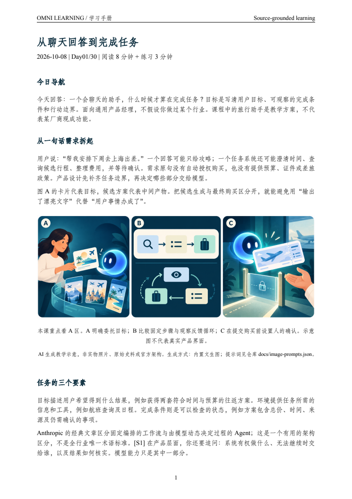

# Omni Learning Assistant × DeepSeek Harness

**非官方社区项目 / Unofficial community project.** Independently maintained; no DeepSeek endorsement or certification is claimed.

[中文](#中文) · [English](#english) · [Omni Learning Assistant](../README.md) · [社区介绍 / Community showcase](https://github.com/deepseek-ai/deepseek-harness/discussions/9207) · [下载 / Download](https://github.com/ShawnRen57/learnpath/releases/tag/v0.2.0)

## 中文

### 安装

1. 下载 [omni-learning-assistant-skill-v0.2.0.zip](https://github.com/ShawnRen57/learnpath/releases/download/v0.2.0/omni-learning-assistant-skill-v0.2.0.zip)，解压得到 `omni-learning-assistant/`。
2. 将**整个文件夹**放到你的 DSH 技能目录，二选一：当前项目 `<project>/.dsh/skills/omni-learning-assistant/`；用户目录 `$DSH_HOME/skills/omni-learning-assistant/`，默认 `~/.dsh/skills/omni-learning-assistant/`。已有同名安装时先备份，再替换；不要覆盖课程数据。
3. 确保最终路径是 `.../skills/omni-learning-assistant/SKILL.md`，旁边有 `scripts/`、`references/`、`agents/`。不要套上额外的仓库目录。
4. 在 DSH 技能目录中确认 `omni-learning-assistant` 已出现。默认文件系统 provider 会监听变更；自定义配置需启用 `@deepseek-ai/dsh-skill` 和 `@deepseek-ai/dsh-skill-filesystem`。

Omni Learning Assistant 通过 DSH 的原生 **Agent Skill 文件系统加载器**集成。它不是 npm/Cordis 服务插件，不要求新增后台服务。安装目录可自定义，以你的 DSH 配置为准。

### 开始学习

在 DSH 中说：

```text
用 Omni Learning Assistant 带我学习西方建筑史，目标是旅行时能看懂建筑。
先确认我的基础和时间安排，再给我 PDF 学习计划；我确认后才创建每日任务。
```

Agent 会追问缺失信息，包括天数、每日学习分钟数、执行时间、时区和输出目录。完整操作还需要联网搜索、文件与命令执行、图片获取或生成、PDF 查看能力，以及 Python 3.10+、XeLaTeX。按 [setup.md](../skills/omni-learning-assistant/references/setup.md) 完成环境检查。以默认用户安装为例，可从终端检查：

```sh
python3 "${DSH_HOME:-$HOME/.dsh}/skills/omni-learning-assistant/scripts/omni_learning.py" --project /absolute/path/to/my-course doctor
```

将示例路径换成已创建且可写的课程目录绝对路径；`doctor` 检查本地依赖，不会验证模型、联网工具或真实通知投递。

### 确认计划后的每日任务

当前上游 Web 配置中的 Host Schedule 支持持久任务，以及带 IANA 时区的每日、每周和 cron 规则。`standard`、`cordis`、`ptc` 预设提供 `schedule_create/list/update/delete`；`minimal` 与被委派的子 Agent 不提供这些工具。请先确认你安装的版本和配置具备对应能力。

确认 PDF 计划后，可以说：

```text
确认这份学习计划。请每天 10:00（Asia/Shanghai）继续这个课程，
使用原生每日定时任务，记录任务 ID，并核对下次执行时间。
每天先读取进度，联网研究后生成和检查 PDF，再在这个会话交付。
```

任务在会话关闭后仍保存，但 **DSH Host 必须运行才能执行**；重启时，周期任务只补发最近一次错过的触发。Host 的投递记录只证明提醒写入了会话，不证明课程 PDF 已完成。Omni Learning Assistant 仍单独核对文档检查与交付状态。

当前上游没有原生暂停。暂停课程后，Omni Learning Assistant 停止生成，Host 可能仍按时唤醒并退出。删除任务可停止唤醒，但会同时删除 Host 投递历史；Agent 应先解释这一影响并保留必要记录。未核验宿主能力时使用手动续学，不能声称已创建自动任务。

### 样例与验证范围

[六组样例](../examples/README.md)包含科技、经济、音乐、Agent 产品、西方建筑史、明朝历史，每组有 30 天计划和 Day01–03，共 24 份 PDF。



v0.2.0 已在 DSH Desktop 0.2.0-rc.2 实测公开 ZIP 安装、原生技能加载、模型调用脚本与首次 PDF 生成，见[验收报告](installation-validation.md)。**连续定时生成与通知尚未实测**；不同预设的工具能力须分别检查。

## English

### Install and start

Download the [v0.2.0 skill ZIP](https://github.com/ShawnRen57/learnpath/releases/download/v0.2.0/omni-learning-assistant-skill-v0.2.0.zip). Extract the complete `omni-learning-assistant/` folder into either `<project>/.dsh/skills/` or `$DSH_HOME/skills/` (default `~/.dsh/skills/`). Back up an existing installation before replacement. Keep course data outside the installed bundle.

The final layout must be `<skill-root>/omni-learning-assistant/SKILL.md`, with sibling scripts, references and agents directories. DSH scans one directory level. Its filesystem skill provider watches changes by default; custom profiles need both `@deepseek-ai/dsh-skill` and `@deepseek-ai/dsh-skill-filesystem`. Verify that `omni-learning-assistant` appears in the skill catalog. This is an Agent Skill integration, not an npm/Cordis service plugin.

Start with:

```text
Use Omni Learning Assistant to teach me Western architectural history so I can understand
buildings when traveling. Ask about my baseline and schedule, then send a
PDF curriculum. Wait for my approval before creating daily tasks.
```

The agent collects missing preferences, checks its research/execution/image/PDF capabilities and Python/XeLaTeX dependencies, then creates the plan. Follow [runtime setup](../skills/omni-learning-assistant/references/setup.md). Use an existing writable course directory for the command above. `doctor` checks local dependencies, not model access or notification delivery.

### Scheduling and limits

After approval, use the installed host's actual schedule tools and verify the saved task ID, daily rule, IANA zone and next run. Current upstream's Web profile provides persistent Host Schedule in the standard/cordis/ptc presets; minimal presets and delegated subagents lack those tools. Tasks survive a closed session, but execution requires the Host to run. Recurring catch-up delivers only the latest missed occurrence. Inbox receipts are not evidence that a PDF was generated or delivered successfully.

Native pause is currently unsupported. Pausing Omni Learning Assistant prevents new lesson generation while host wakeups may continue. Deleting a host task also deletes its saved delivery history, so preserve relevant records and explain that impact before an authorized deletion. Older installed versions may still use the session-local overlay described in LearnPath v0.1.0. Inspect capabilities before promising automatic continuation.

The [first-use report](installation-validation.md) records native loading and first PDF generation from the public ZIP in DSH Desktop 0.2.0-rc.2. Multi-day scheduling and notification delivery remain untested. The six historical sample courses were authored in the Codex local work environment. No official review or certification is implied.

## Official ecosystem and evidence / 官方生态与依据

Checked 2026-10-09 against upstream commit `5badb15009ae1756c3afe0ae0cef1faafc290ccc`:

- [Filesystem Skill provider](https://github.com/deepseek-ai/deepseek-harness/blob/5badb15009ae1756c3afe0ae0cef1faafc290ccc/packages/skill/skill-filesystem/README.md): format, roots and discovery.
- [Host Schedule guide](https://github.com/deepseek-ai/deepseek-harness/blob/5badb15009ae1756c3afe0ae0cef1faafc290ccc/docs/user/guide/schedule.md): presets, persistence, timing and delivery limits.
- [Official README](https://github.com/deepseek-ai/deepseek-harness): community links and `dsh-plugin` repository-topic discovery.
- [Community directory](https://github.com/topics/dsh-plugin) and [Show Your Plugins!](https://github.com/deepseek-ai/deepseek-harness/discussions/categories/show-your-plugins).
- [Community posting rules](https://github.com/deepseek-ai/deepseek-harness/discussions/2004): real integration, screenshots and explicit unofficial labeling.

The official website directs community-plugin discovery to GitHub topics and Discussions. Publishing there does not imply inclusion in a separately reviewed app store.
