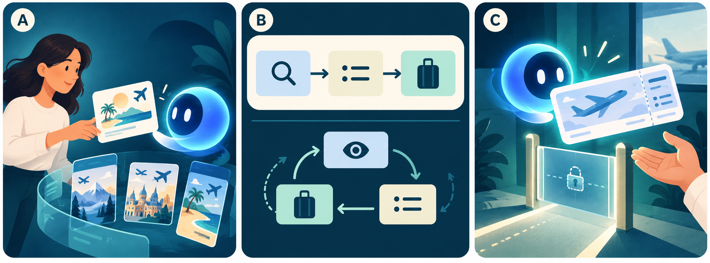

# 从聊天回答到完成任务

2026-10-08 | Day01/30 | 阅读 8 分钟 + 练习 3 分钟

## 今日导航

今天回答：一个会聊天的助手，什么时候才算在完成任务？目标是写清用户目标、可观察的完成条件和行动边界。面向通用产品经理，不假设你做过某个行业。课程中的旅行助手是教学方案，不代表某厂商现成功能。

## 从一句话需求拆起

用户说：“帮我安排下周去上海出差。”一个回答可能只给攻略；一个任务系统还可能澄清时间、查询候选行程、整理费用，并等待确认。需求原句没有自动授权购买，也没有提供预算、证件或差旅政策。产品设计先补齐任务边界，再决定哪些部分交给模型。

图 A 的卡片代表目标，候选方案代表中间产物。把候选生成与最终购买区分开，就能避免用“输出了漂亮文字”代替“用户事情办成了”。

AI生成教学示意，非实物照片、原始史料或官方架构。生成方式：内置文生图；提示词见仓库 docs/image-prompts.json。

## 任务的三个要素

目标描述用户希望得到什么结果，例如获得两套符合时间与预算的往返方案。环境提供任务所需的信息和工具，例如航班查询及日程。完成条件则是可以检查的状态，例如方案包含总价、时间、来源及仍需确认的事项。

Anthropic 的经典文章区分固定编排的工作流与由模型动态决定过程的 Agent；这是一个有用的架构区分，不是全行业唯一术语标准。[S1] 在产品层面，你还要追问：系统有权做什么、无法继续时交给谁，以及结果如何核实。模型能力只是其中一部分。

Google ADK 文档也列出不同类型的 Agent，提示我们框架中的名称不一定等于用户价值。[S5] 不要把“用了多 Agent”写成需求本身；应写清它解决哪一个原本完成不了或完成得很差的步骤。

## 把完成条件写得可以验收

不够清楚的条件是“行程合理、体验顺畅”。更可检查的条件是：明确出发与返回日期，列出两套候选，说明价格查询时间，标出退改条件待用户确认，且没有自动付款。

评估还要区分最终结果与执行过程。一个系统可能碰巧选对方案，却读取了不应读取的数据；也可能工具暂时失败，但正确解释了失败并保留进度。Agent 评估材料强调任务与轨迹的关系，本课程据此要求同时观察结果和关键行为。[S3] 这不意味着每条内部思考都应公开，而是用户需要看见与决策相关的状态和证据。

## 三分钟练习与面试自查

模拟题：“你会怎样定义旅行助手的第一版？”用四句话回答：服务谁、完成什么、明确不自动做什么、用什么结果验收。

参考：“服务需要快速整理差旅选项的员工；完成符合已知限制的候选对比；购买前由用户确认；以条件满足率、事实正确性和需要返工的比例验收。”这些指标是教学建议，尚无真实测试数据。追问：如果航班查询失败怎么办？合理答案应包括解释、保留已知条件和重试或人工接管，而不是继续编造航班。

## 复盘与明日连接

先定义可验证任务，再决定是否需要 Agent。今天的关键不是名词，而是目标、证据与权限能否闭合。明天比较两种实现路线：固定工作流与动态行动，什么时候值得付出更多复杂度？

## 扩展学习（选读）

- [S1] [Building effective agents](https://www.anthropic.com/engineering/building-effective-agents)：读工作流与 Agent 的区分；用作架构框架，不把旧工具清单当最新。；Anthropic；发布 2024-12-19；核验 2026-10-08

- [S2] [Writing effective tools for agents](https://www.anthropic.com/engineering/writing-tools-for-agents)：关注工具边界、返回结果和评价方法如何影响可用性。；Anthropic；发布 2025-09-11；核验 2026-10-08

- [S3] [Demystifying evals for AI agents](https://www.anthropic.com/engineering/demystifying-evals-for-ai-agents)：理解结果评价与执行轨迹；为后续验收指标课程准备。；Anthropic；发布 2026-01-09；核验 2026-10-08

- [S4] [Model Context Protocol specification](https://modelcontextprotocol.io/specification/2025-06-18)：阅读指定版本的用途和安全原则；不称其为最新版本。；MCP project；发布 2025-06-18（指定版本）；核验 2026-10-08

- [S5] [Agents in ADK](https://adk.dev/agents/)：比较 LLM Agent、工作流 Agent 与自定义 Agent 的分类。；Google ADK；发布 未标注；核验 2026-10-08
