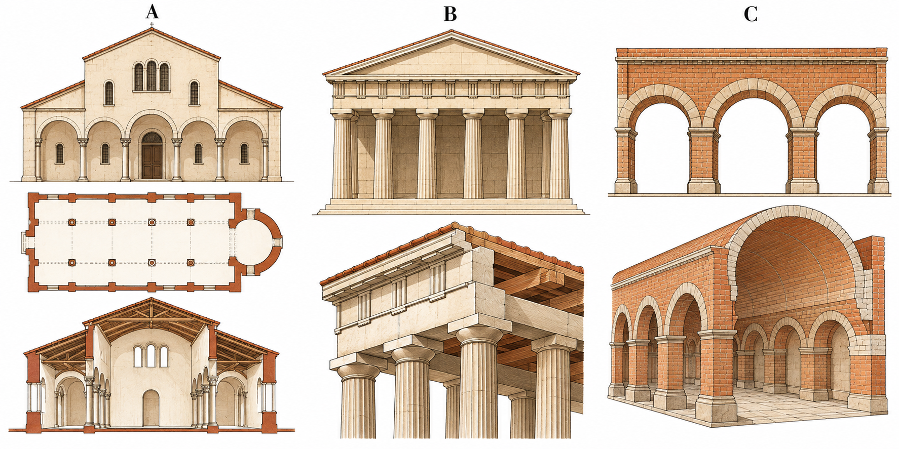

# 罗马拱券与公共空间

2026-10-08 | Day03/30 | 阅读 8 分钟 + 练习 3 分钟

## 今日导航

今天回答：拱券只是一种弯曲的门洞吗？目标是理解拱、拱顶与通道的关系，并用罗马公共建筑说明技术和社会用途如何结合。先回忆昨天的梁柱：跨越空间时，支撑关系怎样表现？

## 从一个拱到有深度的空间

图 C 上部展示连续拱洞，下部展示沿纵深延伸的桶形拱顶。拱与拱顶不仅改变轮廓，也改变覆盖空间的方式。理解它们时同时看两侧支撑，不能只盯拱顶最高点。图为类型示意，不能用来判断真实工程是否安全，也不表示罗马建筑都采用同一种材料。

AI生成教学示意，非实物照片、原始史料或官方架构。生成方式：内置文生图；提示词见仓库 docs/image-prompts.json。

## 结构与路线一起工作

罗马剧场研究资料指出，看台可由混凝土拱顶支撑，内部空间还能提供通往座席的路线。[S2] 因而一个结构构件可能同时参与承重、交通与空间划分。把工程与体验割裂，会错过建筑的重要逻辑。

罗马建筑也使用古典柱式。外立面的柱或附壁柱，与背后承担空间组织的结构未必一一对应。所以看到古典柱就断言“仍是纯粹希腊梁柱体系”，可能忽略了内部的拱券与墙体。分析时把可见形式、实际结构和空间用途分别记录，再寻找联系。

## 公共建筑并不等于平等空间

剧场、竞技场和浴场服务不同活动。大都会关于剧场的讨论还指出，座席分配与社会等级有关，通道组织可以帮助人群到达指定区域。[S2] 这说明建筑是社会制度的物质安排之一；容量大、公众聚集，并不自动等于人人拥有同样的位置或权利。

教学比较：现代体育场也需要疏散、分区、视线和服务空间。这个类比帮助提出问题，却不能把现代票务制度直接投射到古代。若要比较，先分别查清两者使用规则，再讨论共同的空间难题。罗马城市的多个时期叠加也提醒我们，现存遗址不是历史某一天冻结的完整照片。[S4]

## 三分钟练习与自查

给一幅拱廊照片写三条观察：它覆盖什么空间？人可能怎样穿行？你还缺哪项证据，才能确认用途？不要仅凭外观判断建筑年代。

参考：“连续拱洞形成有节奏的开口；通道可能沿建筑边缘展开；需要原址说明或平面确认它是交通、商业还是其他用途。”自查：是否把结构可能性当成已经证明的功能？有没有观察两侧支撑？你的描述是否把人和建筑联系起来？

## 复盘与明日连接

拱券的价值不只在形状，而在它与覆盖、通行及社会组织的关系。今天把材料和结构放回公共生活，完成从希腊形式到罗马空间的第一步比较。明天学习巴西利卡与早期基督教建筑，关注旧空间类型如何进入新的用途。

## 扩展学习（选读）

- [S1] [Architecture in Ancient Greece](https://www.metmuseum.org/essays/architecture-in-ancient-greece)：观察柱式如何连接立柱与建筑其他部分，而非只认柱头。；The Metropolitan Museum of Art；发布 2003-10-01；核验 2026-10-08

- [S2] [Theater and Amphitheater in the Roman World](https://www.metmuseum.org/essays/theater-and-amphitheater-in-the-roman-world)：了解拱券、看台、通道与社会秩序之间的关系。；The Metropolitan Museum of Art；发布 2006-10-01；核验 2026-10-08

- [S3] [Acropolis, Athens](https://whc.unesco.org/en/list/404/)：结合雅典卫城原址资料，区分单栋建筑与建筑群。；UNESCO；发布 未标注；核验 2026-10-08

- [S4] [Historic Centre of Rome](https://whc.unesco.org/en/list/91/)：观察城市历史叠加；不要把罗马城市归为单一风格。；UNESCO；发布 未标注；核验 2026-10-08

- [S5] [Chartres Cathedral](https://whc.unesco.org/en/list/81/)：为后续哥特建筑预习，关注结构、空间与彩色玻璃。；UNESCO；发布 未标注；核验 2026-10-08
