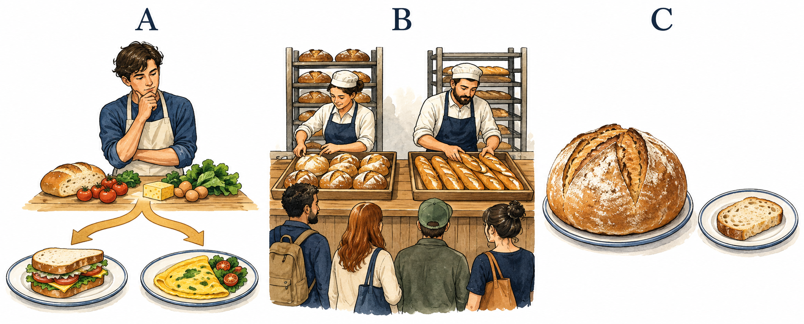

# 稀缺与机会成本

2026-10-08 | Day01/30 | 阅读 8 分钟 + 练习 3 分钟

## 今日导航

今天回答：免费是否意味着没有成本？目标是能辨认稀缺资源，并用“放弃的最佳替代选择”解释机会成本。课程用于理解现象，不提供个人投资建议。开始前想一想：今晚若只能做一件事，你最想把时间给什么？

## 一小时为什么也需要预算

假设你有一个空闲小时，可以读书、运动或看电影。即使三项都不用花钱，也不能把同一小时完整地同时给它们。经济学从稀缺条件下的选择出发；稀缺不等于贫困，而是可用资源相对于目标有限。[S1] 图 A 用有限食材和两种餐食提示这种取舍。换成时间、注意力或公共预算，问题结构仍然存在。

AI生成教学示意，非实物照片、原始史料或官方架构。生成方式：内置文生图；提示词见仓库 docs/image-prompts.json。

## 机会成本不是所有放弃项之和

机会成本是选择一项行动时，放弃的最佳可行替代方案的价值。[S2] 如果你的第二选择是运动，选读书的机会成本应围绕这次运动的价值，而不是把运动、电影、购物的价值全加起来。还要先判断替代方案是否真实可行：没有足够时间完成的远途旅行不该算入今晚的候选。

价值可以是收入，也可以是休息、健康或陪伴。经济学给你一种整理取舍的方法，却不会自动告诉你应该更重视哪一种价值。不同人的处境和目标不同，同一张免费票可能对应不同机会成本。把“我不愿意放弃”说清楚，比强行把一切标成钱更有帮助。

## 教学案例：免费讲座值不值得去

假设讲座门票免费，往返交通20元，交通和听讲合计3小时。最好的替代是完成一项你原本安排好的练习。决策时既看直接支出，也看放弃练习的价值；如果参加讲座可带来你更需要的知识或交流，仍可能值得。

注意不要重复计算：如果你已用一种方式衡量那3小时带来的全部替代收益，就不要又把同一收益换个名称再加一次。也不要声称“任何休息都损失了工资”，除非那段时间确实有可替代的有偿工作。预算约束把可选范围画出来，偏好才决定你在范围内如何选。[S2]

## 三分钟练习与自查

写下明天的一项选择，列三个真实可行的方案，选出最好的两个。用一句话说明：选第一项意味着放弃第二项的什么价值？

参考：“我选择晚上练习钢琴，放弃的是最想参加的朋友聚餐带来的交流机会。”自查三点：资源是否明确？替代方案是否可行？有没有把所有放弃项累加？不需要为陪伴或兴趣强行报价。若方案可以错开进行，机会成本会改变，需重新界定时间条件。

## 复盘与明日连接

稀缺使选择不可避免，机会成本让取舍可见。把自己的选择说清楚以后，还需要理解许多人如何一起协调：明天从面包市场出发，学习价格、需求和供给。社会也面临资源配置问题，生产可能性边界提供了一种简化观察工具，可留到选读再看。[S3]

## 扩展学习（选读）

- [S1] [What Is Economics, and Why Is It Important?](https://openstax.org/books/principles-economics-3e/pages/1-1-what-is-economics-and-why-is-it-important)：从稀缺与分工建立课程起点；文中旧统计不作为现状。；OpenStax；发布 未标注；核验 2026-10-08

- [S2] [Budget Constraint and Individual Choices](https://openstax.org/books/principles-economics-3e/pages/2-1-how-individuals-make-choices-based-on-their-budget-constraint)：重点读机会成本、预算约束与边际分析。；OpenStax；发布 未标注；核验 2026-10-08

- [S3] [Production Possibilities Frontier](https://openstax.org/books/principles-economics-3e/pages/2-2-the-production-possibilities-frontier-and-social-choices)：把个人选择扩展为社会资源配置，观察模型假设。；OpenStax；发布 未标注；核验 2026-10-08

- [S4] [Demand, Supply, and Equilibrium](https://openstax.org/books/principles-economics-3e/pages/3-1-demand-supply-and-equilibrium-in-markets-for-goods-and-services)：对照需求、供给和均衡的图形定义。；OpenStax；发布 未标注；核验 2026-10-08

- [S5] [Shifts in Demand and Supply](https://openstax.org/books/principles-economics-3e/pages/3-2-shifts-in-demand-and-supply-for-goods-and-services)：区分价格变化引起的沿曲线移动与其他条件变化引起的曲线移动。；OpenStax；发布 未标注；核验 2026-10-08
