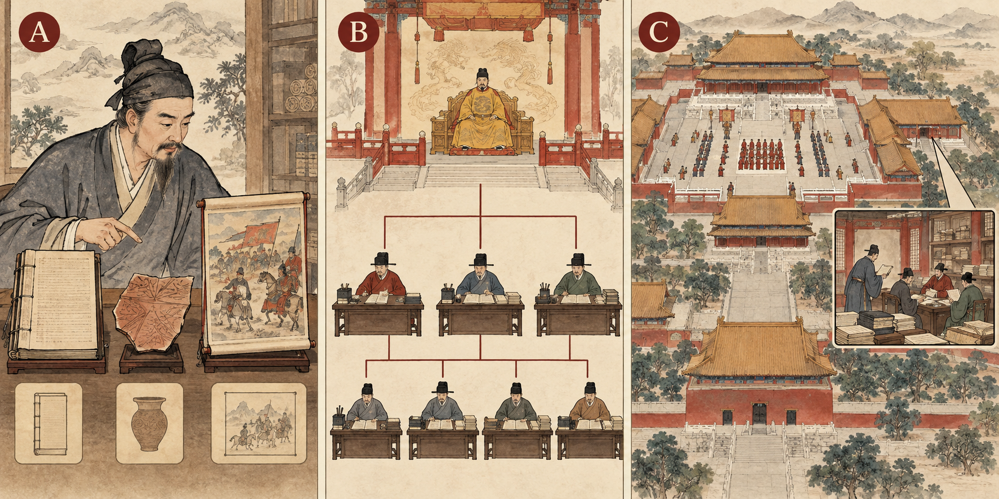

# 时间线与史料如何使用

2026-10-08 | Day01/30 | 阅读 8 分钟 + 练习 3 分钟

## 今日导航

今天回答：知道许多明朝故事，是否就等于理解明朝历史？目标是建立时间线、识别材料类型，并把事实与解释分开。课程从零基础出发，不要求先背完皇帝年表。今天先学如何判断一个说法凭什么成立。

## 给故事放一个时间坐标

明朝通常以1368年至1644年标示其主要王朝时期，这也是博物馆明代艺术概述使用的时间范围。[S1] 但1644年并不意味着所有明代政治活动和社会文化立即消失；具体转折需要在后续课程展开。时间线提供框架，不应成为把复杂变化切成整齐方格的理由。

今天先画一个长条，左端写建立，右端写明清转折，中间留空。接下来逐步加入制度、经济、社会和对外关系。这样做可以避免读到一个故事就把它当作整个时代的代表。

AI生成教学示意，非实物照片、原始史料或官方架构。生成方式：内置文生图；提示词见仓库 docs/image-prompts.json。

## 三类材料回答不同问题

文字材料可能记录命令、事件或作者见闻，但记录者有位置、目的和信息限制。器物能提供材料、工艺和使用痕迹，却不一定直接告诉你制造者的全部意图。图像能展示视觉表达和观看方式，也可能经过理想化安排。

图 A 把书、器物与画作放在一起，是提醒互证，不是出土现场或真实人物肖像。大都会的明代资料主要从宫廷与文人艺术切入，它能支持这部分文化观察，却不能自动代表所有地区和普通人的生活。[S1] 每种材料都有能说明与不能说明的部分。

## 从一句判断拆出证据链

假设有人说：“某幅宫廷画非常华丽，所以当时所有人都很富裕。”你可以把它拆成三步：画作是否确属那个时期？画面和委托者是谁？一个特定群体的作品能否推广到全社会？第一步需要年代与来源，第二步需要作品背景，第三步需要更广泛的经济与社会材料。

博物馆旧展览档案可帮助发现材料种类，但展览选择本身也有主题和范围。[S5] 可靠学习不是要求每次都得到一个肯定答案，而是能说清推论走了多远、还缺什么证据。未经查证的皇帝心理、对白和精确场景，不应混入事实叙述。

## 三分钟练习与自查

任选一句你听过的明史判断，分成“可核实的事实”“作者解释”“我还需要的材料”三栏。若没有现成说法，可用上面的宫廷画例子。

参考：事实栏写作品名称、年代和馆藏信息；解释栏写“华丽意味着普遍富裕”；材料栏写不同地区消费、赋税或生活记录。自查是否把观点换一种语气就当成事实；是否明确了样本范围。今天不要求找到所有材料，只要求识别证据缺口。

## 复盘与明日连接

时间线组织先后，史料帮助约束判断，解释把事实联系起来；三者不能互相替代。明天用“洪武废相”做具体练习，区分制度调整这一事实与它带来的治理问题。

## 扩展学习（选读）

- [S1] [Ming Dynasty (1368–1644)](https://www.metmuseum.org/essays/ming-dynasty-1368-1644)：从文物与艺术观察明代，避免把宫廷与文人经验视为全部社会。；The Metropolitan Museum of Art；发布 2002-10-01；核验 2026-10-08

- [S2] [中书省](https://www.dpm.org.cn/court/system/236406.html)：核对洪武时期机构调整，并把制度事实与作者的因果解释区分开。；故宫博物院；发布 未标注；核验 2026-10-08

- [S3] [Imperial Palaces of the Ming and Qing Dynasties](https://whc.unesco.org/en/list/439/)：查看北京宫殿营建时间、轴线与礼仪空间；注意明清长期改建。；UNESCO；发布 未标注；核验 2026-10-08

- [S4] [Imperial Tombs of the Ming and Qing Dynasties](https://whc.unesco.org/en/list/1004/)：从陵寝空间理解皇权表达，与宫殿材料交叉观察。；UNESCO；发布 未标注；核验 2026-10-08

- [S5] [Arts of the Ming Dynasty](https://www.metmuseum.org/exhibitions/listings/2009/arts-of-the-ming-dynasty)：旧展览档案用于认识作品种类，不代表展览仍在开放。；The Metropolitan Museum of Art；发布 未标注；核验 2026-10-08
