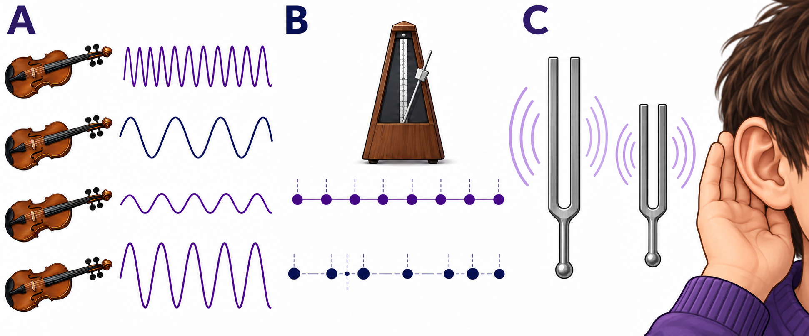

# 音乐通识：30天学习计划

2026-10-08 | 学习计划 / 30 天

## 学习者与目标

适合：爱听音乐但不熟悉乐理的成年人。

本轮目标：用具体听觉线索描述作品，建立持续欣赏方法。30天用于建立入门框架与方法，不承诺掌握整个学科。除明确说明的基础外，不假设学习者的行业经历。原始启动句：“我想学习音乐，提升欣赏不同作品的能力。”

## 学习方式与时间安排

每天预计10–15分钟：正文与读图约8分钟，回忆和练习约3分钟，可用余下时间复述。学习速度存在差异，时间为估计值；扩展阅读不计入必做量。每天10:00（Asia/Shanghai，含周末）开始生成，检查完成后交付。计划确认后可立即生成Day01。

本文件是公开演示样例：30天完整课纲，配套展示Day01–Day03；试跑不创建真实定时任务。图中A、B、C分别对应前三天的观察重点。

AI生成教学示意，非实物照片、原始史料或官方架构。生成方式：内置文生图；提示词见仓库 docs/image-prompts.json。

## 课程依据与学习成果

先从听见音高力度与音色进入，逐渐引入领域概念，再通过案例与复盘连接。来源[S1]和[S2]提供起点知识；其他链接扩展相关视角。课程排序是本项目的教学设计，不是来源机构为本项目背书。

完成时应能：分别描述高低强弱和音色；说明配器如何改变听感；设计可持续的聆听路径。每五天安排一次回顾或整合，检查能否脱离正文解释，不以“收到PDF”代替学会。

## 阶段1：主动聆听

Day01  听见音高力度与音色
目标：分别描述高低强弱和音色。

Day02  节拍节奏与速度
目标：保持脉冲并辨认节奏事件。

Day03  旋律走向与音程
目标：画出乐句音高轮廓。

Day04  乐句与呼吸
目标：标记一句旋律的停顿。

Day05  复盘一次主动聆听
目标：提交三条可听见的观察。

## 阶段2：声音组织

Day06  音阶与调性
目标：辨认稳定感与音阶关系。

Day07  和弦与伴奏
目标：听出伴奏与旋律的分工。

Day08  织体与声部
目标：比较单线和多线组织。

Day09  重复对比与曲式
目标：标出重复与变化。

Day10  复盘作品结构
目标：画一幅简单结构图。

## 阶段3：人声与乐器

Day11  人声与合唱
目标：比较独唱与合唱的表达。

Day12  弦乐器的声音
目标：描述弓弦与拨弦差异。

Day13  木管与铜管
目标：寻找两种管乐音色线索。

Day14  打击与电子声音
目标：辨认打击和电子音色角色。

Day15  复盘配器选择
目标：说明配器如何改变听感。

## 阶段4：西方风格入口

Day16  巴洛克音乐入口
目标：找出模仿或持续低音线索。

Day17  古典主义的对话
目标：描述乐句间的呼应。

Day18  浪漫主义的表达
目标：以具体声音支持情绪描述。

Day19  二十世纪的探索
目标：比较两种组织声音的方法。

Day20  复盘风格比较
目标：给两段作品写比较句。

## 阶段5：多元音乐经验

Day21  中国音乐的线索
目标：承认不同传统的分析边界。

Day22  爵士与即兴
目标：辨认即兴与固定框架的关系。

Day23  流行歌曲的结构
目标：识别主歌副歌等功能段。

Day24  影视音乐与情境
目标：说明情境如何改变感受。

Day25  复盘多元聆听
目标：比较同一方法的适用范围。

## 阶段6：比较与表达

Day26  演奏版本的差别
目标：记录两版演奏的具体差异。

Day27  录音与现场
目标：比较空间与制作影响。

Day28  如何查作品资料
目标：找到可靠作品版本信息。

Day29  写一段有证据的乐评
目标：用观察支持一段评价。

Day30  结业：个人聆听地图
目标：设计可持续的聆听路径。

## 自测、调整与确认

每天先尝试作答，再看参考要点；答不出来时记录具体概念，不据此给自己贴能力标签。每五天用一张卡整理“已经能解释／仍不确定／需要查证”。若学习量过大，优先缩小每日范围并保留主线，不靠减小字体压缩材料。

真实使用时，请确认目标、基础、周期、每天用时、执行时间、时区与输出目录。批准当前计划后才创建任务；修改已开始的课程时保留旧档案并建立新版本。到期漏跑则继续最早未交付课程，不按日期跳课。

## 扩展学习（选读）

- [S1] [Speed of Sound, Frequency, and Wavelength](https://openstax.org/books/physics/pages/14-1-speed-of-sound-frequency-and-wavelength)：选读声音频率与音高的关系，公式推导可跳过。；OpenStax；发布 未标注；核验 2026-10-08

- [S2] [Basic notation](https://openmusictheory.github.io/basicNotation.html)：认识音符、谱表和变音记号；本课不要求记住全部符号。；Open Music Theory；发布 未标注；核验 2026-10-08

- [S3] [Rhythmic values](https://openmusictheory.github.io/rhythmicValues.html)：观察长短时值和休止符如何表达时间。；Open Music Theory；发布 未标注；核验 2026-10-08

- [S4] [Meter and time signatures](https://openmusictheory.github.io/meter.html)：选看拍子分组与聆听示例；部分嵌入播放器可能需要额外登录。；Open Music Theory；发布 未标注；核验 2026-10-08

- [S5] [Intervals and dyads](https://openmusictheory.github.io/intervals.html)：重点看半音数与音程度数不是同一种计数方法。；Open Music Theory；发布 未标注；核验 2026-10-08
