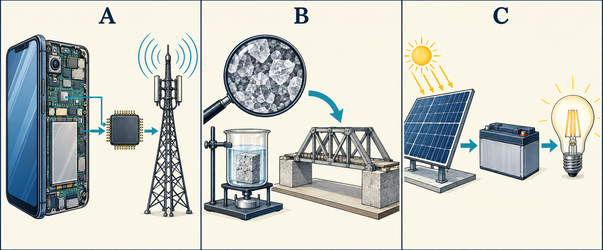

# 科技通识：30天学习计划

2026-10-08 | 学习计划 / 30 天

## 学习者与目标

适合：零基础成年人。

本轮目标：能用系统、证据和约束分析技术新闻。30天用于建立入门框架与方法，不承诺掌握整个学科。除明确说明的基础外，不假设学习者的行业经历。原始启动句：“我想系统学习科技，能看懂重要技术趋势。”

## 学习方式与时间安排

每天预计10–15分钟：正文与读图约8分钟，回忆和练习约3分钟，可用余下时间复述。学习速度存在差异，时间为估计值；扩展阅读不计入必做量。每天10:00（Asia/Shanghai，含周末）开始生成，检查完成后交付。计划确认后可立即生成Day01。

本文件是公开演示样例：30天完整课纲，配套展示Day01–Day03；试跑不创建真实定时任务。图中A、B、C分别对应前三天的观察重点。

AI生成教学示意，非实物照片、原始史料或官方架构。生成方式：内置文生图；提示词见仓库 docs/image-prompts.json。

## 课程依据与学习成果

先从从手机看技术系统进入，逐渐引入领域概念，再通过案例与复盘连接。来源[S1]和[S2]提供起点知识；其他链接扩展相关视角。课程排序是本项目的教学设计，不是来源机构为本项目背书。

完成时应能：拆出输入处理输出与瓶颈；核查一条新闻的证据边界；提交一页有来源的判断卡。每五天安排一次回顾或整合，检查能否脱离正文解释，不以“收到PDF”代替学会。

## 阶段1：系统与证据

Day01  从手机看技术系统
目标：拆出输入处理输出与瓶颈。

Day02  科学证据与工程取舍
目标：区分演示证据与使用结论。

Day03  能量转换与效率
目标：完成一次功率和用电量换算。

Day04  材料为何改变产品
目标：解释材料选择的两项约束。

Day05  复盘一件日常科技产品
目标：综合画一张产品系统图。

## 阶段2：数字技术基础

Day06  晶体管与计算
目标：说明开关与计算的联系。

Day07  数据如何被表示
目标：比较数字表示与真实对象。

Day08  算法与可计算问题
目标：辨认算法输入输出与限制。

Day09  网络如何传递信息
目标：描述一次信息传递路径。

Day10  复盘数字系统
目标：定位数字系统的故障环节。

## 阶段3：人工智能

Day11  机器学习的基本问题
目标：区分训练与推断。

Day12  大模型能做什么
目标：列出模型能做与难做的任务。

Day13  模型评估与失效
目标：提出两项验证方法。

Day14  隐私与安全边界
目标：识别数据流中的风险点。

Day15  复盘一条AI新闻
目标：核查一条新闻的证据边界。

## 阶段4：生命科学

Day16  生命科学的尺度
目标：在不同尺度上定位生命现象。

Day17  基因与遗传信息
目标：区分遗传信息与环境影响。

Day18  生物技术的证据
目标：辨认实验与应用之间的步骤。

Day19  医学研究如何阅读
目标：识别样本与结论适用范围。

Day20  复盘研究新闻
目标：改写一条夸大研究结论。

## 阶段5：能源与大型工程

Day21  能源系统与电网
目标：画出发输配用的关系。

Day22  储能与可再生能源
目标：比较储能方案的约束。

Day23  气候模型与不确定性
目标：解释预测与情景的区别。

Day24  航天系统与任务约束
目标：给任务列出质量成本限制。

Day25  复盘大型工程
目标：复盘一次系统取舍。

## 阶段6：技术与社会

Day26  从原理到商业化
目标：列出规模化所需条件。

Day27  技术扩散与基础设施
目标：解释基础设施如何影响普及。

Day28  标准与公共治理
目标：区分技术选择与公共规则。

Day29  比较两条科技路线
目标：按同一标准比较两种路线。

Day30  结业：写一页科技判断卡
目标：提交一页有来源的判断卡。

## 自测、调整与确认

每天先尝试作答，再看参考要点；答不出来时记录具体概念，不据此给自己贴能力标签。每五天用一张卡整理“已经能解释／仍不确定／需要查证”。若学习量过大，优先缩小每日范围并保留主线，不靠减小字体压缩材料。

真实使用时，请确认目标、基础、周期、每天用时、执行时间、时区与输出目录。批准当前计划后才创建任务；修改已开始的课程时保留旧档案并建立新版本。到期漏跑则继续最早未交付课程，不按日期跳课。

## 扩展学习（选读）

- [S1] [Physics: Definitions and Applications](https://openstax.org/books/physics/pages/1-1-physics-definitions-and-applications)：从物理学与技术的关系入手，区分解释自然和解决实际问题。；OpenStax；发布 未标注；核验 2026-10-08

- [S2] [The Electromagnetic Spectrum](https://science.nasa.gov/ems/)：查看波谱教学材料，理解通信与成像共享的物理基础。；NASA；发布 未标注；核验 2026-10-08

- [S3] [Electricity 101](https://www.energy.gov/oe/electricity-101)：只读发电、输电、配电与 kWh 的基础解释；历史统计不作当前数据。；美国能源部；发布 未标注；核验 2026-10-08

- [S4] [AI measurement and evaluation](https://www.nist.gov/ai-measurement-and-evaluation)：观察准确性之外的可靠性与可解释性维度，为后续技术评估做准备。；NIST；发布 未标注；核验 2026-10-08

- [S5] [The Silicon Engine](https://www.computerhistory.org/siliconengine/)：沿晶体管与集成电路历史观察技术如何通过多项改进进入系统。；Computer History Museum；发布 未标注；核验 2026-10-08
