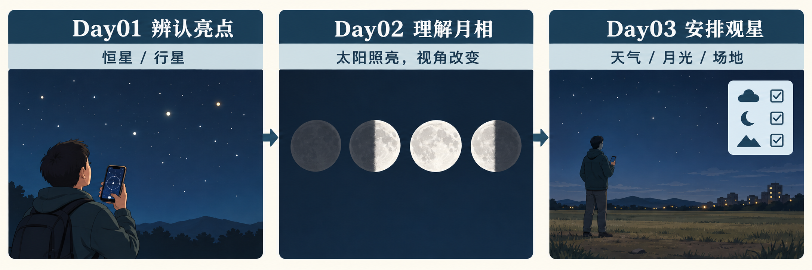

# 安排观星：做一张肉眼出行卡

2026-10-09 | Day03/3 | 阅读 10 分钟 + 练习 5 分钟

## 先回忆，再组合｜2分钟

不看旧课，先回答两题：如何核对一个夜空亮点的身份？普通月相与月食有什么区别？

参考起点：先观察，再核对星图的地点、日期时间与方向；普通月相来自可见受光部分变化，月食涉及月球进入地球影子。今天把这些知识用于出行准备，不再增加一串天体名称。

目标：完成一张七项齐全的观星卡，能解释至少两项选择，并能调整不合适的目标。共15分钟：回忆2分钟，阅读6分钟，填写5分钟，自检2分钟；实际户外观察与选读另计，用时为估计。

## 概念一｜能看到什么，取决于条件

肉眼和已有手机星图足以作为入门工具。先选一个简单目标：核对一个亮点，或者辨认月面的明暗形态；不把望远镜和购买器材作为课程前提。[S4]

天气与周围灯光都影响观察。地图上的暗色地点也可能有云层，现场还可能被树木或建筑遮挡；因此准备要同时检查当地天气、视野与夜间是否允许进入。[S1][S3]

明亮月光会让较暗的星星更难辨认。检查月相时，还要核对当地月升月落；只记住“今晚是满月”并不能代替整段观察时间的条件判断。[S1]

如果目标改为观察月面，月亮本身就成为观察对象。用肉眼先描述亮面和较大的明暗区域，不承诺能看清小环形山，也不保证某晚一定可见。[S5]

复用本课程2026-10-09实际文生图生成的教学插图；非官方图或观测证据。提示词与目视检查见research/image-record.json。

## 概念二｜星图是一份有条件的参照

手机星图能按观察地点、日期和时间显示天空。出行后，应再次核对地点与时区、日期时间、朝向，再查看目标的大致方位与高度；不能把上次旅行的设置直接当成此次答案。[S2][S4]

星图中的天体名字不等于现场已经看见。云层、地形与光线可能使目标无法辨认，手机方向显示也应和现场方向交叉核对。本课只训练核对步骤，不提供指定地点和日期的天象预报。

看图C区：人、手机和清单表达“先准备再核对”。星点、地形、天体大小都是教学示意，不是可用来找星的真实地图。把C区的准备与A区的辨认、B区的月相连起来，才是本课用途。

## 例子｜条件改变，就调整目标

假设旅行时本想辨认较暗的星星，却发现天空有明亮月光。合理做法是核对月球是否在观察时段升起，再根据现场条件改为描述月面，或推迟暗弱目标；“地点远离城市”本身不能保证看见。[S1][S5]

如果云层遮住天空，就记录天气与当前目标，回到室内练习星图设置。这个备用方案是本课设计的练习，不是来源中对某次出行的预测。今天的课程产出是准备卡，不要求真的等到夜里执行。

## 5分钟练习｜填写七项出行卡

第1分钟：1. 天气——未来出发前查什么？2. 月光——检查月相及当地月升月落；本次只写检查项，不编造天气和月相数据。

第2分钟：3. 场地——记录可进入的夜间地点、视野与周围灯光检查；真实旅行时补入当地信息。

第3分钟：4. 星图——地点、日期时间、时区、方向；5. 目标——只选一个，例如“核对一个亮点”或“辨认月相”，并写“需现场核实可见性”。

第4分钟：6. 记录——写下时间、地点、方向、看到的现象和不确定处；不要把猜测写成确认身份。

第5分钟：7. 备用方案——云多、月光强、场地不可进入分别如何调整？再圈出两项选择，解释为什么这样安排。以上是一张可填写模板，不含具体出行预测。

## 自检与课程结束｜2分钟

对照七项：天气、月光、场地、星图设置、目标、记录、备用方案。缺项时补写；理由示例：检查当地月升月落，因为明亮月光可能影响暗弱目标；复核星图日期地点，因为天空参照随观察条件变化。[S1][S2]

再闭卷解释：为何“不闪烁”只是线索？为何弦月不应解释为地球影子？如何在条件改变时调整出行卡？答不清的题标为待复习，回看相应课程。收到三份PDF不代表已经掌握。

这份3天课程到此结束，不再生成Day04。下一步可在未来旅行前补入实况，或反馈自己的卡点，另拟更深入的计划供确认。选做户外观察另计时间：充分暗适应可能需要半小时或更久，减少频繁看亮屏；先保证能看清脚下与返回路线，不把课程的15分钟理解为完整观测时长。[S1][S3]

## 扩展学习（选读）

- [S1] [How to Find Good Places to Stargaze](https://science.nasa.gov/solar-system/skywatching/how-to-find-good-places-to-stargaze/): 选读月光、场地与到达后准备三节；文中的美国地点不是中国旅行预测。更新2024-11-04。; NASA Science / Preston Dyches | 发布：2021-07-28 | 核验：2026-10-09

- [S2] [Find Planets in the Sky](https://www.jpl.nasa.gov/edu/resources/project/find-planets-in-the-sky/): 选读步骤3、5、6、8，核对地点时间与方向高度；原项目较长，本课只做设置卡。更新2024-09-27。; NASA JPL Education | 发布：未标注 | 核验：2026-10-09

- [S3] [Stargazing for Beginners](https://science.nasa.gov/solar-system/skywatching/night-sky-network/may2024-night-sky-notes/): 选读No Equipment及屏幕光线段落；跳过历史月份星图，不额外购置装备。; NASA Night Sky Network / Kat Troche | 发布：2024-05-01 | 核验：2026-10-09

- [S4] [Skywatching FAQ](https://science.nasa.gov/skywatching/faq/): 读工具与当地可见性两问；区分入门工具和实际观测验证。; NASA Science | 发布：未标注 | 核验：2026-10-09

- [S5] [Moon Viewing Tips](https://science.nasa.gov/moon/viewing-tips/): 选读Eyeballing the Moon，了解肉眼月面观察的范围；望远镜段落为选读。; NASA Science | 发布：未标注 | 核验：2026-10-09
